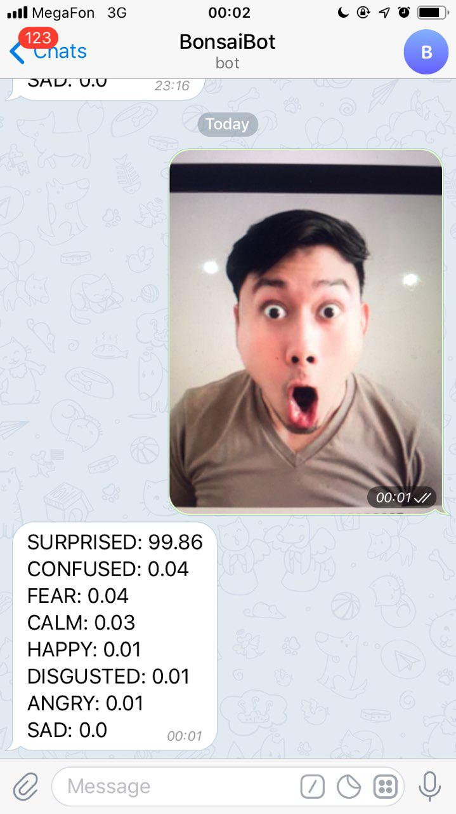

# Intro

This is a telegram bot that uses AWS Rekognition to detect emotions on selfies.




# Installation

## ☁️ 0. Create AWS account, authorize your computer

- If you don't have an AWS Account - create it (you will need to enter your credit card, sorry)
- Install [AWS CLI](https://docs.aws.amazon.com/cli/latest/userguide/cli-chap-install.html)
- Configure CLI by running `aws configure` and enter your credentials ([manual here](https://docs.aws.amazon.com/cli/latest/userguide/cli-chap-configure.html#cli-quick-configuration))


## 🔌 1. Install dependencies

This works for Python>=3.7.

```
pip install -r requirements.txt
```

or:

```
poetry install
```
## 🛠️ 2. Generate unique names

The app needs a DynamoDB table and an S3 bucket with unique names.
Create these names by running:

```
flask prepare
flask createdb
```

This will create an `.env` file in your app directory with required variables.

---

## 🏹 3. Deploy code to Lambda

Run:

```
zappa deploy dev
```

You will get some console output. Most important two lines are: 

```
Uploading serverless-reko-dev-1570307440.zip (6.0MiB)..
...
Your updated Zappa deployment is live!: https://xxxxxxx.execute-api.us-east-1.amazonaws.com/dev
```

- From the first line, remember the function name: `serverless-reko-dev`
- From the last line, remember the endpoint: `https://xxxxxxx.execute-api.us-east-1.amazonaws.com/dev`

Open the `.env` file in the app folder and add two variables from above: 

```
LAMBDA_FUNCTION_NAME=serverless-reko-dev
LAMBDA_ENDPOINT=https://xxxxxxx.execute-api.us-east-1.amazonaws.com/dev
```

Okay, you have deployed your code but, there is a bit more to configure.

## 🤖 4. Add Telegram bot token

Create a Telegram bot [like this](https://core.telegram.org/bots#6-botfather)

Add bot token to `.env` file:

```
...

TELEGRAM_TOKEN=your-telegram-token
```

Run commands:
```
flask connect-bot
```

## 🔥 5. Have fun!

Now send some selfies to your chatbot. It should be able to reply.


## ☠️ 6. Teardown

If you want to delete everything, you need to do two things:

- To undeploy your app, run: `zappa undeploy dev`
- To drop the DynamoDB table and S3 bucket with photos, run `flask dropdb`.
